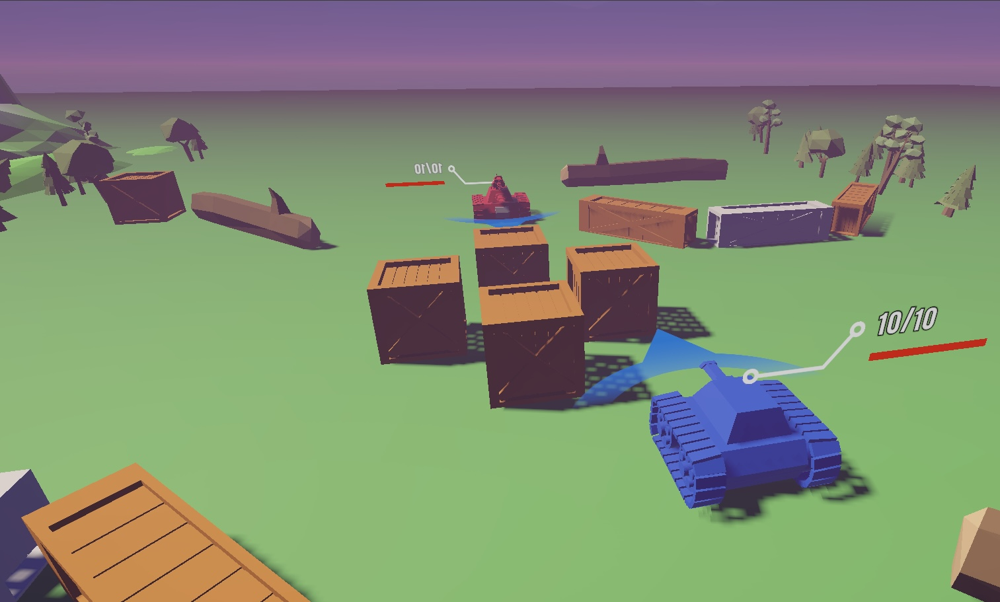

# TankWar-Assault

 

## 📄 Game Description
> This is a multiplayer tank combat project supporting up to 20 concurrent players. 
> Networking and matchmaking are implemented with Unity Netcode for GameObjects.
> Players select a tank, equip different weapons and skills, and engage in fast-paced matches.
> The game is cross-platform and supports both desktop and mobile devices.

# 📡 Tech Stack 
- **Unity**: Game development platform.
- **Unity Visual Effect Graph**: For creating visual effects.
- **Cinemachine**: A plugin for Unity camera control. In this project, the plugin uses Cinemachine Tracks component to help me create a scrollbar that controls the camera's sight direction.
- **[Netcode for GameObjects](https://unity.com/products/netcode)**: Networking SDK.
- **[Unity Lobby](https://unity.com/products/lobby), [Unity Relay](https://unity.com/products/relay)**: Unity Lobby to connet players and join in game.

- **[DoTween](https://dotween.demigiant.com/)**: A plugin about animation engine for Unity
- **[Odin inspector](https://odininspector.com/)**: A plugin that uses Attributes to easily draw editor UI

## 🎮 How to Play
1. Open the game and setting you tank and game preference.
2. back to menu and click "PLAY".
3. Wait in the game until the second player joins, then the game will start.
4. You can use joystck to move and click fire button to shoot.
5. Watch as your tank and enemy's tank to action your skill or another weapon.
6. Stand on area in the game and destroy enemy's tower to get more point.
7. Repeat the action until the game over!

## Installation
1. Clone the repository:
   ```bash
   git clone https://github.com/andongni0723/Unity_TankWar-Assault.git
   ```
2. Open the project in Unity (version 6000.0.32f1 or later).
